# 📘 Manual de Operación: Agente de Calidad de Datos con IA (Data Quality)

Este documento describe el flujo de trabajo completo para utilizar el Agente de IA que genera y publica automáticamente **Reglas de Calidad de Datos** en Google Cloud Dataplex (Data Scans).

## 🔄 Flujo del Proceso

El proceso consta de 4 etapas principales:

```mermaid
graph LR
    A[🚀 Ejecución del Agente] -->|Genera Reglas DQ| B[📝 Pull Request en GitHub];
    B -->|Humano Revisa| C{✅ ¿Aprobado?};
    C -- Sí (Merge) --> D[⚙️ GitHub Actions];
    D -->|Publica| E[☁️ Dataplex AutoDQ];
    D -->|Registra| F[📊 BigQuery Audit Log];
```



---

## Prerequisitos

1. Activar el entorno virtual:
   ```bash
   .venv\Scripts\activate
   # O en Mac/Linux:
   source .venv/bin/activate
   ```
2. Instalar dependencias:
   ```bash
   pip install -r requirements.txt
   ```
3. Configurar credenciales de GCP (Application Default Credentials):
   ```bash
   gcloud auth application-default login
   ```
4. Configurar variables de entorno (ver `config/settings.py` o crea un `.env` basado en tus necesidades).

### 1. 🚀 Ejecución del Agente (Generación)
El proceso comienza ejecutando el agente localmente o programado.

**Comando:**
```bash
python main.py
```

**Lo que hace el agente:**
1.  Conecta a **BigQuery** y lee los metadatos (schemas, perfiles de datos) del dataset objetivo.
2.  Envía estos metadatos a **Gemini 2.5 Flash**.
3.  Gemini genera una propuesta de **Reglas de Calidad** (Complitud, Unicidad, Validez, etc.) en formato JSON/YAML.
4.  Crea una **rama nueva** en GitHub y abre una **Pull Request (PR)** con la propuesta.

---

### 2. 📝 Revisión Humana (Gobierno)
Un Data Steward (usuario) recibe la notificación de la PR en GitHub.

**Acciones:**
1.  Revisar las reglas de calidad propuestas en la pestaña "Files changed".
2.  Puede sugerir cambios en los umbrales o reglas directamente en GitHub.
3.  Si está conforme, hace clic en **"Merge pull request"**.

---

### 2.1 ⚙️ Ejecución Manual (Opcional)
Para publicar las reglas en Dataplex sin pasar por GitHub Actions (ejecución local), se puede usar:
```bash
python scripts/publish_data_quality.py
```

---

### 3. ⚙️ Publicación Automática (CI/CD)
Al aprobar (hacer merge) la PR, se dispara automáticamente un flujo de trabajo ("Deploy Data Quality Rules").

**Lo que ocurre en segundo plano:**
1.  GitHub Actions descarga la última versión aprobada de las reglas.
2.  Ejecuta el script de publicación (`scripts/publish_data_quality.py`).
3.  Usa la API de **Dataplex** para crear o actualizar los **Data Scans** (AutoDQ) en Google Cloud.
    *   Configura las reglas (SQL o predefinidas).
    *   Define el ámbito (tablas completas o incrementales).
    *   Programa la ejecución (si aplica).

---

### 4. 📊 Auditoría y Trazabilidad
Como paso final, el sistema registra la operación.

**Destino:** BigQuery (Tabla de logs de auditoría especificada en configuración).
**Datos registrados:**
*   `timestamp`: Fecha y hora exactas.
*   `actor`: Usuario de GitHub que aprobó el cambio.
*   `status`: `APPROVED_AND_PUBLISHED` o `FAILED`.
*   `details`: Resumen de reglas publicadas y tablas afectadas.

---

## 🛠️ Configuración Previa Requerida

Para que este flujo funcione, se necesitan los siguientes secretos en el repositorio de GitHub:

1.  `GCP_SA_KEY`: JSON de una Service Account de Google Cloud con permisos de **Dataplex Editor**, **BigQuery User**, y **Service Usage Consumer**.
2.  `GCP_PROJECT_ID`: ID del proyecto.

---

## 💡 Preguntas Frecuentes

**¿Qué pasa si rechazo la PR?**
Nada se publica en Dataplex. El proceso se detiene y no hay cambios en las reglas de calidad activas.

**¿Cómo cambio el dataset a analizar?**
Edita las configuraciones en `config/settings.py` o las variables de entorno correspondientes.

**¿Dónde veo los resultados de la calidad de datos?**
En la consola de Google Cloud -> Dataplex -> Data Scans.
